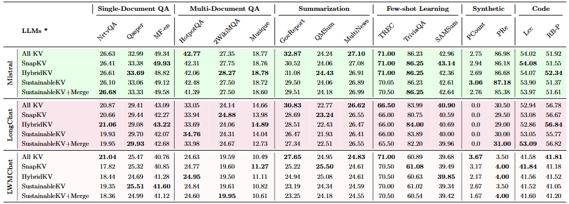
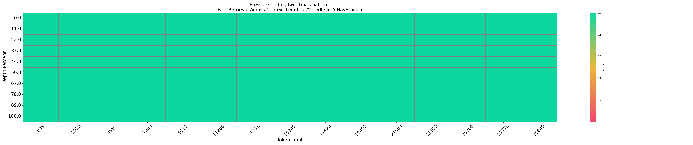

# ✂️ SustainableKV
This repo is the official implementation of the KV cache eviction algorithm -- SustainableKV. We guarantee all experiment results are reproducible.
## 🛠️ Environment Setup
```
conda create --name sustainablekv python=3.11
conda activate sustainablekv

git clone https://github.com/YUECHE77/SustainableKV.git
cd SustainableKV
pip install -e .
pip install -r requirements.txt
```
⚠️ We recommend manually installing PyTorch and FlashAttention to avoid version conflicts.

1. Install PyTorch (CUDA 11.8):

    ```
    pip uninstall torch torchvision torchaudio -y
    pip install torch==2.3.0 torchvision==0.18.0 torchaudio==2.3.0 --index-url https://download.pytorch.org/whl/cu118
    ```

2. Install FlashAttention:
    
    FlashAttention is sensitive to version mismatches. You can find all official wheels [here](https://github.com/Dao-AILab/flash-attention/releases?page=1).
    
    A configuration that guaranteed to work:
    cuda11.8, python3.11, pytorch==2.3.0, flash_attn==2.5.8
    
    Check your ABI setting:
    ```
    python -c "import torch; print(torch._C._GLIBCXX_USE_CXX11_ABI)"  # Just to check to use abiFALSE or abiTRUE
    ```
    Then install the correct wheel:
    ```
    pip install https://github.com/Dao-AILab/flash-attention/releases/download/v2.5.8/flash_attn-2.5.8+cu118torch2.3cxx11abiFALSE-cp311-cp311-linux_x86_64.whl
    ```

## 🔥Quick Start
1. Download the models from HuggingFace (please refer to [model](./experiments/LongBench/config/model2path.json)). Currently, we support Mistral / Mixtral / LLaMA Family. Then replace your model path [here](./experiments/LongBench/config/model2path.json).
2. We prepare a [demo](./notebooks/example.py). You can modify the [`method`](./notebooks/example.py#L19), [`model_to_use`](./notebooks/example.py#L25), and [`model2path`](./notebooks/example.py#L35) to test our methods. Please also modify the path to the SnapKV's paper in line 54, which is the input document.

## 💯Key Implementations
The detailed algorithm of SustainableKV is in the file [`sustainablekv_utils.py`](./SustainableKV/sustainablekv_utils.py)

You can easily integrate SustainableKV with other models. Just follow the same pattern as those [existing models](./SustainableKV/monkeypatch.py). Currently, we support [Llama family](./SustainableKV/llama_hijack.py)/ [Mistral](./SustainableKV/mistral_hijack.py)/ [Mixtral](./SustainableKV/mixtral_hijack.py)

## 🧪Reproduce the Experiments results

1. LongBench:
    ```
    cd experiments/LongBench
    bash longbench.sh
    ```
2. Needle In A Haystack:
    ```
    cd experiments/NeedleInHaystack
    python pred_sustainable.py \
        --model-name lwm-text-chat-1m \
        -s 1000 \
        -e 30000 \
        --num-intervals 15 \
        --compress \
        --save-folder /the/folder/path
    ```

## ✨Partial Results



## Acknowledgement
Many thanks to [SnapKV](https://github.com/FasterDecoding/SnapKV) for their great work!!!